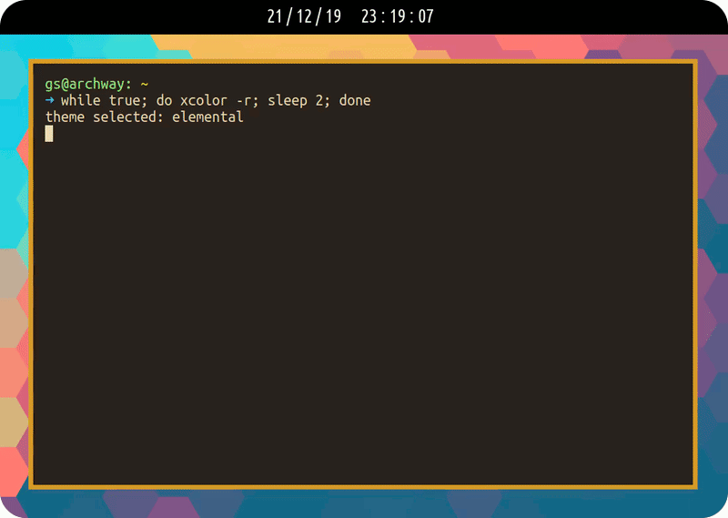

<p align="center">
    
</p>

# Xcolor

Change \*nix colorschemes on the fly ✈️ written in pure POSIX sh

## How does it work?

Xcolor comes in two parts: editing Xresources to include a configuration file which defines all the colors for the selected theme, and dynamically reloading all TTYs to the correct colors via escape sequences.

Once Xresources contains the proper environment variables, the database is reloaded along with any bars, WMs / DEs, etc the user is using.

Unfortunately, this change will only effect terminals opened after this point. To get currently open terminals to update, escape sequences are used. A file with the necessary sequences is generated and placed in `$XDG_CACHE_HOME` before being sent to each open terminal instance.

## Will it work on my system?

Xcolor is confirmed working with the following configurations:

Terminal Emulators:

* `urxvt`
* `xterm`
* `st` (requires xresources patch)
* `xst`
* `termite`

WMs/DEs:

* `i3`
* `sway`
* `bspwm`
* `xmonad`

Bars:

* `polybar`
* `xmobar` 

This list will be updated as more configurations are tested.

Certain terminal emulators inherently will not allow you to source the colorscheme from `.Xresources`. One approach to get around this, as is used in [dylanaraps pywal utility](https://github.com/dylanaraps/pywal), is to put the following line in your `.bashrc`, `.zshrc`, etc:

`(cat ~/.cache/xcolor/xcolor.sequence &)`

## How do I get it?

First-time installation procedure:

```bash
git clone https://github.com/grahamsider/xcolor.git
cd xcolor
./install
./xcolor [options]
```

A proper, user-wide installer is to be added in the future. As a temporary work-around, simply simlink the xcolor script to `/usr/local/bin`:

```bash
sudo ln -s /absolute/path/to/xcolor /usr/local/bin
```

## How do I use it?

Once installed, run `xcolor -h` for a shortlist of available options. Options of particular interest are as follows:

* `xcolor -t $theme_name` sets your current theme to `$theme_name`
* `xcolor -r` chooses a random theme out of all available themes
* `xcolor -l` lists all available themes (useful for grepping)
* `xcolor -c` displays the currently set theme

Xcolor allows you to save your favorite themes into a "favorites list". Use the `-f` option alongside the previous commands to use the favorites list for the specified query:

* `xcolor -s $theme_name` saves `$theme_name` to your favorites
* `xcolor -s` saves the currently set theme to your favorites
* `xcolor -d $theme_name` deletes `$theme_name` from your favorites
* `xcolor -d` deletes the currently set theme from your favorites
* `xcolor -rf` chooses a random theme out of all themes saved in favorites
* `xcolor -lf` lists all themes saved in favorites

## How do I make my own themes?

Xcolor now supports over 200 themes!

To create your own, simply a copy of the template (located at `themes/template`) and edit the hex color values to your liking. When you're finished, just copy it to `$XDG_CONFIG_HOME/xcolor/themes` and you're good to go!

## How do I use these colors in other programs?

### i3

i3 allows you to source resources into variables via the `set_from_resource` keyword. The general format is:

`set_from_resource $name_for_i3 color_num backup_color`

Example:

```bash
# Set the focused window borders to bold yellow
set_from_resource $yellow_b color11 #ffffff
client.focused $yellow_b $yellow_b $yellow_b $yellow_b
```

### Bspwm

TODO

### Sway

TODO

### Polybar

Polybar can source its various colors from `.Xresources` with the following syntax:

`${xrdb:XRESOURCE-COLOR:FALLBACK-COLOR}`

Example:

```ini
; Set background and foreground colors
background = ${xrdb:color0:#ffffff}
foreground = ${xrdb:color15:#ffffff}
```

### Rofi

As of version 0.4.3, a new file will appear in the `$XDG_CACHE_HOME/xcolor` directory by the name of `xcolor.rasi`. This file may be imported into a rofi `.rasi` configuration to synchronize rofi with xcolor. To do this, add the following to the **end** of your `.rasi` config (replacing `USER` with the appropriate username):

```css
@import "/home/USER/.cache/xcolor/xcolor.rasi"
```

This file defines the current xcolor theme colors for use as `@foreground`, `@background`, `@cursor`, and `@color[0-15]`.

### Spicetify

Spicetify themes can have their `color.ini` file edited to support colors from `.Xresources`. The syntax is nearly identical to that of Polybar.

Example:

```ini
[Base]

main_fg                               = ${xrdb:color4:#ffffff}
secondary_fg                          = ${xrdb:foreground:#ffffff}
main_bg                               = ${xrdb:background:#ffffff}
sidebar_and_player_bg                 = ${xrdb:background:#ffffff}
cover_overlay_and_shadow              = ${xrdb:background:#ffffff}
indicator_fg_and_button_bg            = ${xrdb:color2:#ffffff}
pressing_fg                           = ${xrdb:color1:#ffffff}
slider_bg                             = ${xrdb:background:#ffffff}
sidebar_indicator_and_hover_button_bg = ${xrdb:color2:#ffffff}
scrollbar_fg_and_selected_row_bg      = ${xrdb:background:#ffffff}
pressing_button_fg                    = ${xrdb:color2:#ffffff}
pressing_button_bg                    = ${xrdb:background:#ffffff}
selected_button                       = ${xrdb:color2:#ffffff}
miscellaneous_bg                      = ${xrdb:background:#ffffff}
miscellaneous_hover_bg                = FFFFFF
preserve_1                            = FFFFFF
```

### Dunst

TODO

### Zathura

As of version 0.4.6, a new file will appear in the `$XDG_CACHE_HOME/xcolor` directory by the name of `xcolor.zathura`. This may be sourced and used for by putting the following into your `zathurarc` (replacing `USER` with the appropriate username):

```
include /home/USER/.cache/xcolor/xcolor.zathura

set recolor true
```

If you do not wish zathura to start in the colored theme on each startup, remove `set recolor true`. Zathura may still be recolored manually (e.g. via `ctrl+r`).


### Python Scripts (e.g. QuteBrowser)

Python-based applications can query `.Xresources` through `xrdb -query`. This is especially useful for applications that use a python configuration file, such as QuteBrowser. An example of how you can go about loading in `.Xresources` values is shown below.

```python
import subprocess
import sys, os

def read_xresources(prefix):
    props = {}
    x = subprocess.run(['xrdb', '-query'], stdout=subprocess.PIPE)
    lines = x.stdout.decode().split('\n')
    for line in filter(lambda l : l.startswith(prefix), lines):
        prop, _, value = line.partition(':\t')
        props[prop] = value
    return props

xresources = read_xresources('*')

black      =  xresources['*.color0']
red        =  xresources['*.color1']
green      =  xresources['*.color2']
yellow     =  xresources['*.color3']
blue       =  xresources['*.color4']
magenta    =  xresources['*.color5']
cyan       =  xresources['*.color6']
white      =  xresources['*.color7']
black_b    =  xresources['*.color8']
red_b      =  xresources['*.color9']
green_b    =  xresources['*.color10']
yellow_b   =  xresources['*.color11']
blue_b     =  xresources['*.color12']
magenta_b  =  xresources['*.color13']
cyan_b     =  xresources['*.color14']
white_b    =  xresources['*.color15']
bg         =  xresources['*.background']
fg         =  xresources['*.foreground']
```

These definitions can then be used throughout the rest of the python configuration file. For example, in a QuteBrowser configuration file, you may find the lines similar to the following:

```python
c.colors.messages.info.fg = fg
```

Furthermore, if you wish to make slight adjustments to the colors, using `.Xresources` as a starting point, the following code may be useful as well:

```python
def clamp(val, minimum=0, maximum=255):
    if val < minimum:
        return minimum
    if val > maximum:
        return maximum
    return val

def adjust(hexstr, scalefactor):
    hexstr = hexstr.strip('#')
    if scalefactor < 0 or len(hexstr) != 6:
        return hexstr

    r, g, b = int(hexstr[:2], 16), int(hexstr[2:4], 16), int(hexstr[4:], 16)
    r = int(clamp(r * scalefactor))
    g = int(clamp(g * scalefactor))
    b = int(clamp(b * scalefactor))

    return "#%02x%02x%02x" % (r, g, b)
```

And may be used in the following form:

```python
c.colors.statusbar.url.success.http.fg  = adjust(fg, 0.7)
c.colors.statusbar.url.success.https.fg = adjust(fg, 0.7)
```

### Shell Scripts

Querying `.Xresources` variables can be done via `xrdb -query`. This can be further piped through applications such as `grep` and `sed` to extract the desired string.

### <a name="haskell-xres-func"></a>XMonad/Haskell

XResources can be configured using the function fromXres defined below:
```
import Data.Maybe
import Data.Bifunctor
import Data.List as DL
import Data.Char as DC

import System.IO
import System.IO.Unsafe

import XMonad
import XMonad.Util.Run

getFromXres :: String -> IO String
getFromXres key = fromMaybe "" . findValue key <$> runProcessWithInput "xrdb" ["-query"] ""
  where
    findValue :: String -> String -> Maybe String
    findValue xresKey xres =
      snd <$> (
                DL.find ((== xresKey) . fst)
                $ catMaybes
                $ splitAtColon
                <$> lines xres
              )

    splitAtColon :: String -> Maybe (String, String)
    splitAtColon str = splitAtTrimming str <$> (DL.elemIndex ':' str)

    splitAtTrimming :: String -> Int -> (String, String)
    splitAtTrimming str idx = bimap trim trim . (second tail) $ splitAt idx str

    trim :: String -> String
    trim = DL.dropWhileEnd (DC.isSpace) . DL.dropWhile (DC.isSpace)

fromXres :: String -> String
fromXres = unsafePerformIO . getFromXres
```
Credits to reddit user [/u/Joantmilev](https://www.reddit.com/user/Joantmilev/) from this [thread](https://www.reddit.com/r/xmonad/comments/kfwfma/how_to_pull_xresources_for_xmonad_config_settings/).

### Xmobar

Xmobar is traditionally use with the Xmonad WM. Within your xmonad.hs use the [`fromXres`](#haskell-xres-func) function as so:
```
    xmobarBgColor = fromXres "*.color0"
    xmobarFgColor = fromXres "*.color15"
    spawnPipe $ "xmobar " ++ 
                "-B \"" ++ xmobarBgColor ++  "\" " ++ -- Set the background color
                "-F \"" ++ xmobarFgColor ++  "\" " ++ -- Set the foreground color
                -- ... continue configuration
```
